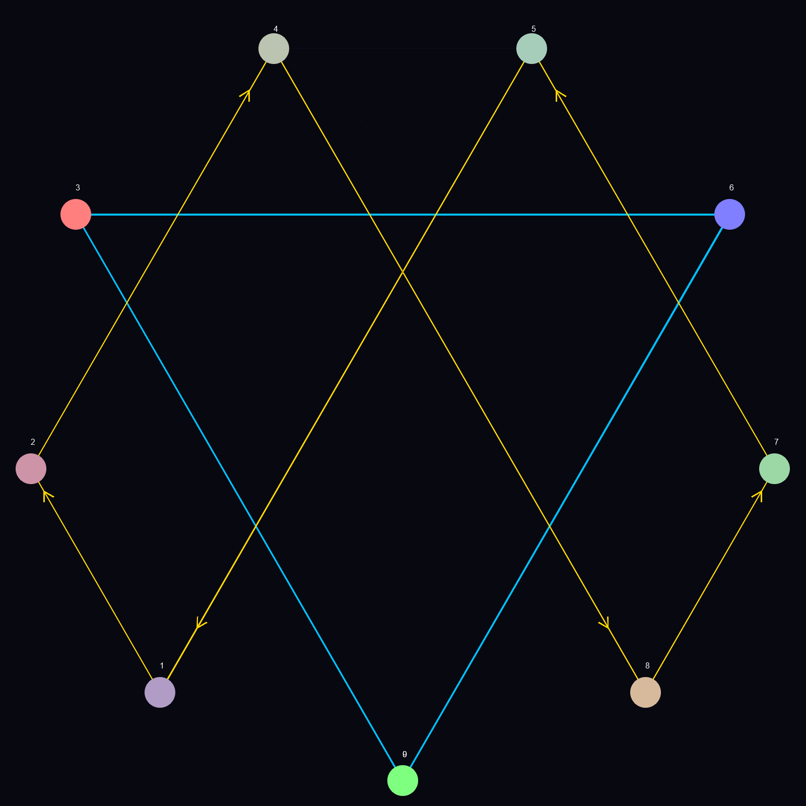

# SpatialVortex Assets

Static assets including images, icons, and media files for SpatialVortex.

---

## 📂 Directory Structure

### **images/** - Image Assets
Screenshots, visualizations, diagrams, and generated images.

**Current Images**:
- **flux_matrix_2d.png** - 2D flux matrix visualization
- **test_output.png** - Test output visualization
- Additional visualization outputs

---

## 🎨 Asset Guidelines

### Image Files

**Formats**:
- PNG for screenshots and diagrams
- SVG for logos and icons (preferred)
- JPG for photos (if needed)

**Naming Convention**:
- Use snake_case: `flux_matrix_2d.png`
- Be descriptive: `vortex_flow_diagram.png`
- Include version if needed: `logo_v2.svg`

### Organization

Place assets in appropriate subdirectories:
- `images/` - General images and visualizations
- `images/screenshots/` - Application screenshots (if needed)
- `images/diagrams/` - Architecture diagrams (if needed)

---

## 📝 Adding New Assets

1. **Choose Location**: Place in appropriate subdirectory
2. **Name Properly**: Follow naming convention
3. **Optimize**: Compress images before adding
4. **Document**: Add entry to this README if significant

---

## 🖼️ Asset Inventory

### Visualizations

- **flux_matrix_2d.png** - 2D flux matrix rendering
  - Size: ~140 KB
  - Purpose: Documentation, testing

- **test_output.png** - Test visualization output
  - Size: ~55 KB
  - Purpose: Testing, validation

---

## 🗂️ Asset Management

### Version Control

- ✅ Include small assets (<1MB)
- ⚠️ Large assets (>1MB) should be linked externally
- ❌ Don't commit temporary test outputs

### Optimization

Before committing images:
```bash
# Optimize PNG
optipng image.png

# Or use online tools
# TinyPNG, ImageOptim, etc.
```

---

## 📚 Usage in Documentation

Reference assets in markdown:
```markdown

```

In code comments:
```rust
// See visualization: assets/images/flux_matrix_2d.png
```

---

## 🎯 Asset Checklist

When adding new assets:
- [ ] Placed in correct directory
- [ ] Named according to convention
- [ ] Optimized file size
- [ ] Added to README inventory
- [ ] Documented purpose
- [ ] Verified in git (if committing)

---

**Location**: `/assets/`  
**Purpose**: Static media assets  
**Maintained**: As needed
