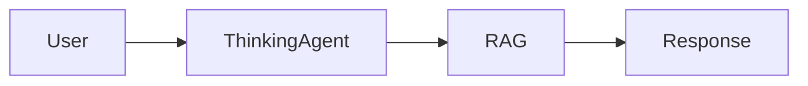

# 🎨 Advanced Formatting Features

## What's Already Working ✅

### **1. Basic Markdown**
- ✅ **Bold text** with `**text**`
- ✅ *Italic text* with `*text*`
- ✅ `Inline code` with backticks
- ✅ Links: [text](url)
- ✅ Line breaks

### **2. Lists** (Just Fixed!)
- ✅ Numbered lists with proper spacing
- ✅ Bullet lists with spacing
- ✅ Nested lists

### **3. Code Blocks**
- ✅ Syntax highlighting
- ✅ Language detection
- ✅ Copy button

### **4. Headers**
- ✅ H1, H2, H3 with color
- ✅ Proper spacing

### **5. Semantic Colors**
- ✅ Text color based on mood
- ✅ Meaning badges
- ✅ Hover tooltips

---

## 🚀 What We Can Add Next

### **Priority 1: High Impact, Easy to Implement**

#### **1. Blockquotes** 📝

**Current**: Limited styling
```markdown
> This is a quote
```

**Enhanced**:
```css
blockquote {
  background: #1e1e2e;
  border-left: 4px solid #cba6f7;
  padding: 1rem;
  margin: 1rem 0;
  font-style: italic;
  border-radius: 4px;
}
```

**Visual**:
```
┃ "The only way to do great work is to love what you do."
┃ — Steve Jobs
```

---

#### **2. Tables** 📊

**Example Input**:
```markdown
| Feature | Status | Priority |
|---------|--------|----------|
| Lists   | ✅ Done | High    |
| Tables  | 🔄 Next | High    |
| Math    | 📋 Plan | Medium  |
```

**Enhanced Styling**:
```css
table {
  width: 100%;
  border-collapse: collapse;
  margin: 1rem 0;
}

th {
  background: #313244;
  color: #cba6f7;
  padding: 0.75rem;
  text-align: left;
  font-weight: 600;
}

td {
  padding: 0.75rem;
  border-bottom: 1px solid #313244;
}

tr:hover {
  background: #1e1e2e;
}
```

---

#### **3. Callout Boxes** 💡

**Types**: Info, Warning, Error, Success, Tip

**Example**:
```markdown
> ℹ️ **Info**: This is helpful information
> ⚠️ **Warning**: Be careful here
> ❌ **Error**: Something went wrong
> ✅ **Success**: Task completed!
> 💡 **Tip**: Pro tip for you
```

**Styling**:
```css
.callout-info { border-left-color: #89b4fa; background: #1e2030; }
.callout-warning { border-left-color: #f9e2af; background: #2e2820; }
.callout-error { border-left-color: #f38ba8; background: #2e1e24; }
.callout-success { border-left-color: #a6e3a1; background: #1e2e24; }
.callout-tip { border-left-color: #cba6f7; background: #251e2e; }
```

---

#### **4. Task Lists** ✓

**Example**:
```markdown
- [x] Fix text formatting
- [x] Add semantic colors
- [ ] Implement tables
- [ ] Add math support
```

**Visual**:
```
☑ Fix text formatting
☑ Add semantic colors
☐ Implement tables
☐ Add math support
```

---

#### **5. Horizontal Rules** ➖

**Usage**: Section separators

```markdown
---
```

**Styled**:
```css
hr {
  border: none;
  height: 2px;
  background: linear-gradient(to right, #313244, #cba6f7, #313244);
  margin: 2rem 0;
}
```

---

### **Priority 2: Medium Impact**

#### **6. Collapsible Sections** 🔽

**Example**:
```html
<details>
  <summary>Click to expand details</summary>
  Hidden content here...
</details>
```

**Use Cases**:
- Long explanations
- Technical details
- Code examples
- References

---

#### **7. Footnotes** [¹]

**Example**:
```markdown
This statement needs a citation[^1].

[^1]: Source: Research paper, 2024
```

**Visual**:
```
This statement needs a citation¹.

────────
1. Source: Research paper, 2024
```

---

#### **8. Math Equations** 🔢

**Using KaTeX or MathJax**:

**Inline**: `$E = mc^2$` → E = mc²

**Block**:
```latex
$$
\int_{-\infty}^{\infty} e^{-x^2} dx = \sqrt{\pi}
$$
```

**Visual**:
```
  ∞
  ⌠
  ⌡  e^(-x²) dx = √π
 -∞
```

---

#### **9. Mermaid Diagrams** 📊

**Flowcharts, sequences, gantt charts**:



**Visual**:
```
User → ThinkingAgent → RAG → Response
```

---

#### **10. Syntax Highlighting Themes** 🎨

**Current**: Basic highlighting

**Enhanced**: Multiple themes
- Dracula
- Monokai
- GitHub
- Tomorrow Night
- Catppuccin (matches our dark theme!)

---

### **Priority 3: Advanced Features**

#### **11. Diff Highlighting** ➕➖

**Show code changes**:

```diff
- old_function()
+ new_function()
  unchanged_line()
```

**Styled**:
```css
.diff-remove { background: #2e1e24; color: #f38ba8; }
.diff-add { background: #1e2e24; color: #a6e3a1; }
```

---

#### **12. Copy to Clipboard (Enhanced)** 📋

**Current**: Basic copy

**Enhanced**:
- Copy button on all code blocks
- Copy button on text selections
- Toast notification on copy
- "Copied!" feedback

---

#### **13. Message Reactions** 👍

**Add emoji reactions**:
```
[Message]
👍 3  ❤️ 5  🎉 2  💡 1
```

**Use Cases**:
- Helpful response
- Funny response
- Insightful answer

---

#### **14. Search & Highlight** 🔍

**Search within messages**:
```typescript
const searchTerm = "reasoning";
// Highlights all instances in yellow
```

**Visual**:
```
The AI uses chain-of-thought <mark>reasoning</mark>
```

---

#### **15. Message Threading** 🧵

**Reply to specific messages**:
```
Message A
  └─ Reply to A
     └─ Reply to reply
Message B
```

---

#### **16. LaTeX Blocks** 📐

**For scientific/math content**:

```latex
\begin{align}
  f(x) &= \sum_{n=0}^{\infty} \frac{f^{(n)}(a)}{n!}(x-a)^n \\
  &= f(a) + f'(a)(x-a) + \frac{f''(a)}{2!}(x-a)^2 + \cdots
\end{align}
```

---

#### **17. Progress Bars** 📊

**Show task progress**:
```
Training: [████████░░] 80%
```

**Styled**:
```css
.progress-bar {
  background: #313244;
  border-radius: 8px;
  overflow: hidden;
}

.progress-fill {
  background: linear-gradient(90deg, #89b4fa, #cba6f7);
  height: 20px;
  transition: width 0.3s ease;
}
```

---

#### **18. Tooltips** 💬

**Hover for definitions**:

```html
<abbr title="Artificial Super Intelligence">ASI</abbr>
```

**Visual**:
```
"ASI" [hover] → "Artificial Super Intelligence"
```

---

#### **19. Badges & Tags** 🏷️

**Categorize content**:

```html
<span class="badge">New</span>
<span class="badge">Beta</span>
<span class="badge">Recommended</span>
```

**Visual**: [New] [Beta] [Recommended]

---

#### **20. Image Support** 🖼️

**Inline images from AI**:

```markdown

```

**Features**:
- Lightbox on click
- Zoom controls
- Download button

---

## 🎯 Recommended Implementation Order

### **Phase 1: Quick Wins** (1-2 days)
1. ✅ Enhanced blockquotes
2. ✅ Callout boxes (info/warning/error)
3. ✅ Task lists
4. ✅ Horizontal rules
5. ✅ Better tables

### **Phase 2: Medium Priority** (3-5 days)
6. ⏳ Collapsible sections
7. ⏳ Footnotes
8. ⏳ Math equations (KaTeX)
9. ⏳ Copy button improvements
10. ⏳ Syntax theme selection

### **Phase 3: Advanced** (1-2 weeks)
11. 📋 Mermaid diagrams
12. 📋 Diff highlighting
13. 📋 Message reactions
14. 📋 Search & highlight
15. 📋 Message threading

### **Phase 4: Future** (as needed)
16. 💭 LaTeX blocks
17. 💭 Progress bars
18. 💭 Image support
19. 💭 Custom components
20. 💭 Interactive elements

---

## 💡 Most Impactful Next Steps

### **Top 5 to Implement**:

1. **Callout Boxes** 💡
   - Instant visual hierarchy
   - Perfect for warnings/tips
   - Easy to implement

2. **Better Tables** 📊
   - Common in AI responses
   - Much clearer data display
   - High user value

3. **Task Lists** ✓
   - Great for action items
   - Visual progress
   - Interactive checkboxes

4. **Collapsible Sections** 🔽
   - Manage long responses
   - Progressive disclosure
   - Better UX

5. **Math Support** 🔢
   - Essential for technical content
   - Professional appearance
   - Wide use case

---

## 🛠️ Implementation Guide

### **Step 1: Callout Boxes**

```typescript
// In preprocessText()
function detectCallouts(text: string): string {
  const calloutRegex = /^>\s*(ℹ️|⚠️|❌|✅|💡)\s*\*\*(.+?)\*\*:\s*(.+)$/gm;
  
  return text.replace(calloutRegex, (match, icon, type, content) => {
    const calloutType = {
      'ℹ️': 'info',
      '⚠️': 'warning',
      '❌': 'error',
      '✅': 'success',
      '💡': 'tip'
    }[icon];
    
    return `<div class="callout callout-${calloutType}">
      <span class="callout-icon">${icon}</span>
      <strong>${type}:</strong> ${content}
    </div>`;
  });
}
```

### **Step 2: Enhanced Tables**

```css
/* Already supported by marked.js! Just add styling */
.message-content.markdown :global(table) {
  width: 100%;
  border-collapse: collapse;
  margin: 1rem 0;
  background: #181825;
  border-radius: 8px;
  overflow: hidden;
}

.message-content.markdown :global(th) {
  background: #313244;
  color: #cba6f7;
  padding: 0.75rem;
  text-align: left;
  font-weight: 600;
  border-bottom: 2px solid #45475a;
}

.message-content.markdown :global(td) {
  padding: 0.75rem;
  border-bottom: 1px solid #313244;
}

.message-content.markdown :global(tr:hover) {
  background: #1e1e2e;
}
```

### **Step 3: Task Lists**

```typescript
// Marked.js supports this with GFM!
// Just enable and style:
marked.setOptions({
  gfm: true,  // Already enabled
});
```

```css
.message-content.markdown :global(input[type="checkbox"]) {
  margin-right: 0.5rem;
  cursor: pointer;
}

.message-content.markdown :global(li:has(input[type="checkbox"])) {
  list-style: none;
  margin-left: -1.5rem;
}
```

---

## 🎨 Visual Examples

### **Callout Box**
```
╔═══════════════════════════════════════╗
║ 💡 Tip: Use RAG for fact-grounded    ║
║        responses                      ║
╚═══════════════════════════════════════╝
```

### **Table**
```
┌──────────┬─────────┬──────────┐
│ Feature  │ Status  │ Priority │
├──────────┼─────────┼──────────┤
│ Lists    │ ✅ Done │ High     │
│ Tables   │ 🔄 Next │ High     │
│ Math     │ 📋 Plan │ Medium   │
└──────────┴─────────┴──────────┘
```

### **Task List**
```
☑ Design UI mockups
☑ Implement backend
☐ Write documentation
☐ Deploy to production
```

---

## ✨ Summary

**Currently Working**: 
- Basic markdown
- Numbered/bullet lists (with spacing!)
- Code blocks
- Headers
- Semantic colors

**Quick Wins** (Easy + High Impact):
1. Callout boxes
2. Better tables
3. Task lists
4. Collapsible sections
5. Math equations

**Advanced** (Future):
- Diagrams (Mermaid)
- Message threading
- Reactions
- Search & highlight

**Which should we implement first?** 🚀
