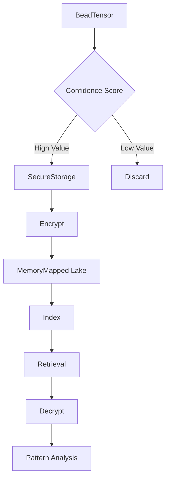

# Confidence Lake - SOTA Documentation

**Status**: 🔴 **To Be Implemented** (Current: 28%)  
**Target**: 85%+ (Secure encrypted storage for high-value patterns)  
**Timeline**: 1.5 weeks  
**Dependencies**: `aes-gcm-siv`, `memmap2`, `sled` or `rocksdb`

---

## Overview

Confidence Lake is a secure, encrypted storage system for preserving high-value moments and patterns identified during real-time processing. It uses AES-GCM-SIV for authenticated encryption and memory-mapped files for efficient I/O.

### Architecture



---

## Module Structure

```
src/confidence_lake/
├── mod.rs                  # Public API
├── encryption.rs           # AES-GCM-SIV encryption
├── storage.rs              # mmap-based persistence
├── scoring.rs              # Confidence calculation
├── index.rs                # Timestamp/position indexing
└── retrieval.rs            # Authenticated decryption
```

---

## API Reference

### SecureStorage - Encryption Layer

```rust
use aes_gcm_siv::{Aes256GcmSiv, Key, Nonce};
use aes_gcm_siv::aead::{Aead, NewAead, generic_array::GenericArray};
use rand::RngCore;

/// Provides AES-GCM-SIV authenticated encryption for high-value data.
///
/// AES-GCM-SIV is chosen for its nonce-misuse resistance, critical
/// for long-running processes where nonce generation might fail.
///
/// # Examples
///
/// ```
/// use spatial_vortex::confidence_lake::SecureStorage;
///
/// let key = [0u8; 32]; // In production: derive from password
/// let storage = SecureStorage::new(&key);
///
/// let data = b"High-value pattern data";
/// let encrypted = storage.encrypt(data)?;
/// let decrypted = storage.decrypt(&encrypted)?;
///
/// assert_eq!(data, decrypted.as_slice());
/// # Ok::<(), anyhow::Error>(())
/// ```
pub struct SecureStorage {
    cipher: Aes256GcmSiv,
}

impl SecureStorage {
    /// Creates a new secure storage instance with the given key.
    ///
    /// # Arguments
    ///
    /// * `key` - 256-bit (32-byte) encryption key
    ///
    /// # Security
    ///
    /// Key should be derived from a password using a KDF like Argon2.
    /// Never hardcode keys in production code.
    pub fn new(key: &[u8; 32]) -> Self {
        let key = Key::from_slice(key);
        let cipher = Aes256GcmSiv::new(key);
        Self { cipher }
    }
    
    /// Encrypts plaintext with authenticated encryption.
    ///
    /// # Arguments
    ///
    /// * `plaintext` - Data to encrypt
    ///
    /// # Returns
    ///
    /// * `Result<Vec<u8>>` - Nonce (12 bytes) + ciphertext + tag (16 bytes)
    ///
    /// # Format
    ///
    /// ```text
    /// [nonce: 12 bytes][ciphertext: N bytes][tag: 16 bytes]
    /// ```
    pub fn encrypt(&self, plaintext: &[u8]) -> anyhow::Result<Vec<u8>> {
        // Generate random nonce
        let mut nonce_bytes = [0u8; 12];
        rand::thread_rng().fill_bytes(&mut nonce_bytes);
        let nonce = Nonce::from_slice(&nonce_bytes);
        
        // Encrypt and authenticate
        let ciphertext = self.cipher
            .encrypt(nonce, plaintext)
            .map_err(|e| anyhow::anyhow!("Encryption failed: {}", e))?;
        
        // Prepend nonce for storage
        let mut result = Vec::with_capacity(nonce_bytes.len() + ciphertext.len());
        result.extend_from_slice(&nonce_bytes);
        result.extend_from_slice(&ciphertext);
        
        Ok(result)
    }
    
    /// Decrypts and authenticates ciphertext.
    ///
    /// # Arguments
    ///
    /// * `ciphertext` - Encrypted data (nonce + ciphertext + tag)
    ///
    /// # Returns
    ///
    /// * `Result<Vec<u8>>` - Original plaintext
    ///
    /// # Errors
    ///
    /// Returns error if authentication fails (data tampered) or
    /// ciphertext format is invalid.
    pub fn decrypt(&self, ciphertext: &[u8]) -> anyhow::Result<Vec<u8>> {
        if ciphertext.len() < 12 {
            return Err(anyhow::anyhow!("Invalid ciphertext: too short"));
        }
        
        // Extract nonce and ciphertext
        let (nonce_bytes, encrypted) = ciphertext.split_at(12);
        let nonce = Nonce::from_slice(nonce_bytes);
        
        // Decrypt and verify
        self.cipher
            .decrypt(nonce, encrypted)
            .map_err(|e| anyhow::anyhow!("Decryption failed: {}", e))
    }
}
```

---

### ConfidenceLake - Storage Layer

```rust
use memmap2::{MmapMut, MmapOptions};
use std::fs::OpenOptions;
use std::path::Path;
use std::collections::HashMap;

/// Memory-mapped storage for encrypted high-value patterns.
///
/// Uses mmap for efficient zero-copy I/O and persistence.
/// Maintains an in-memory index for fast retrieval.
///
/// # Examples
///
/// ```no_run
/// use spatial_vortex::confidence_lake::ConfidenceLake;
/// use std::path::Path;
///
/// let path = Path::new("confidence.lake");
/// let mut lake = ConfidenceLake::create(path, 100)?; // 100 MB
///
/// let data = b"encrypted pattern data";
/// let timestamp = chrono::Utc::now().timestamp() as u64;
///
/// lake.store(timestamp, data)?;
/// let retrieved = lake.retrieve(timestamp)?;
///
/// assert_eq!(data, retrieved.as_slice());
/// # Ok::<(), anyhow::Error>(())
/// ```
pub struct ConfidenceLake {
    mmap: MmapMut,
    index: HashMap<u64, Entry>,  // timestamp -> Entry
    free_offset: usize,
}

#[derive(Debug, Clone)]
struct Entry {
    offset: usize,
    length: usize,
}

impl ConfidenceLake {
    /// Creates a new confidence lake file.
    ///
    /// # Arguments
    ///
    /// * `path` - File path for the lake
    /// * `size_mb` - Initial size in megabytes
    ///
    /// # Returns
    ///
    /// * `Result<Self>` - ConfidenceLake instance
    pub fn create(path: &Path, size_mb: usize) -> anyhow::Result<Self> {
        let file = OpenOptions::new()
            .read(true)
            .write(true)
            .create(true)
            .open(path)?;
        
        // Set file size
        let size_bytes = (size_mb * 1024 * 1024) as u64;
        file.set_len(size_bytes)?;
        
        // Memory map the file
        let mmap = unsafe { MmapOptions::new().map_mut(&file)? };
        
        Ok(Self {
            mmap,
            index: HashMap::new(),
            free_offset: 0,
        })
    }
    
    /// Stores encrypted data with timestamp key.
    ///
    /// # Arguments
    ///
    /// * `timestamp` - Unix timestamp (seconds since epoch)
    /// * `data` - Encrypted data to store
    ///
    /// # Errors
    ///
    /// Returns error if lake is full (no free space).
    pub fn store(&mut self, timestamp: u64, data: &[u8]) -> anyhow::Result<()> {
        // Check if we have space
        if self.free_offset + data.len() > self.mmap.len() {
            return Err(anyhow::anyhow!("Confidence Lake is full"));
        }
        
        // Write data
        let offset = self.free_offset;
        let length = data.len();
        self.mmap[offset..offset + length].copy_from_slice(data);
        
        // Update index
        self.index.insert(timestamp, Entry { offset, length });
        self.free_offset += length;
        
        // Flush to disk
        self.mmap.flush()?;
        
        Ok(())
    }
    
    /// Retrieves encrypted data by timestamp.
    ///
    /// # Arguments
    ///
    /// * `timestamp` - Unix timestamp key
    ///
    /// # Returns
    ///
    /// * `Result<Vec<u8>>` - Encrypted data
    ///
    /// # Errors
    ///
    /// Returns error if timestamp not found.
    pub fn retrieve(&self, timestamp: u64) -> anyhow::Result<Vec<u8>> {
        let entry = self.index
            .get(&timestamp)
            .ok_or_else(|| anyhow::anyhow!("Timestamp not found: {}", timestamp))?;
        
        Ok(self.mmap[entry.offset..entry.offset + entry.length].to_vec())
    }
    
    /// Lists all stored timestamps.
    pub fn list_timestamps(&self) -> Vec<u64> {
        self.index.keys().copied().collect()
    }
    
    /// Returns storage utilization percentage.
    pub fn utilization(&self) -> f64 {
        self.free_offset as f64 / self.mmap.len() as f64 * 100.0
    }
}
```

---

### Confidence Scoring

```rust
use crate::models::ELPTensor;

/// Computes confidence scores for pattern preservation decisions.
///
/// High-value patterns are identified by:
/// 1. Proximity to sacred positions (3, 6, 9)
/// 2. High ELP tensor magnitude
/// 3. Voice energy/intensity
/// 4. Semantic importance (optional ML model)
///
/// # Examples
///
/// ```
/// use spatial_vortex::confidence_lake::ConfidenceScorer;
/// use spatial_vortex::models::ELPTensor;
///
/// let scorer = ConfidenceScorer::new(8.0); // threshold
///
/// let elp = ELPTensor { ethos: 10.0, logos: 11.0, pathos: 9.0 };
/// let score = scorer.compute(&elp, 2.5, 80.0);
///
/// if scorer.is_high_value(score) {
///     println!("High-value pattern! Score: {}", score);
/// }
/// ```
pub struct ConfidenceScorer {
    threshold: f64,
}

impl ConfidenceScorer {
    /// Creates a new confidence scorer.
    ///
    /// # Arguments
    ///
    /// * `threshold` - Minimum score for high-value classification
    pub fn new(threshold: f64) -> Self {
        Self { threshold }
    }
    
    /// Computes confidence score for a pattern.
    ///
    /// # Arguments
    ///
    /// * `elp_tensor` - ELP tensor values
    /// * `sacred_distance` - Distance to nearest sacred position (3,6,9)
    /// * `voice_energy` - Voice intensity (0-100 range)
    ///
    /// # Returns
    ///
    /// * `f64` - Confidence score (higher = more valuable)
    ///
    /// # Formula
    ///
    /// ```text
    /// score = magnitude × sacred_bonus × energy_factor
    /// where:
    ///   magnitude = sqrt(E² + L² + P²)
    ///   sacred_bonus = 2.0 if distance < 1.0, else 1.0
    ///   energy_factor = voice_energy / 50.0 (clamped to 0.5-2.0)
    /// ```
    pub fn compute(
        &self,
        elp_tensor: &ELPTensor,
        sacred_distance: f64,
        voice_energy: f64,
    ) -> f64 {
        // Base score: tensor magnitude
        let magnitude = (
            elp_tensor.ethos.powi(2) +
            elp_tensor.logos.powi(2) +
            elp_tensor.pathos.powi(2)
        ).sqrt();
        
        // Bonus for sacred proximity
        let sacred_bonus = if sacred_distance < 1.0 { 2.0 } else { 1.0 };
        
        // Energy factor (normalize and clamp)
        let energy_factor = (voice_energy / 50.0).clamp(0.5, 2.0);
        
        magnitude * sacred_bonus * energy_factor
    }
    
    /// Checks if score qualifies as high-value.
    pub fn is_high_value(&self, score: f64) -> bool {
        score >= self.threshold
    }
    
    /// Computes decay factor for old patterns.
    ///
    /// Older patterns decay in importance unless reinforced.
    ///
    /// # Arguments
    ///
    /// * `age_hours` - Age in hours since pattern creation
    ///
    /// # Returns
    ///
    /// * `f64` - Decay multiplier (1.0 = no decay, 0.0 = fully decayed)
    pub fn decay_factor(&self, age_hours: f64) -> f64 {
        // Exponential decay: e^(-λt) where λ = 0.01/hour
        (-0.01 * age_hours).exp()
    }
}
```

---

## Integration Example

Complete workflow with encryption and storage:

```rust
use spatial_vortex::confidence_lake::*;
use spatial_vortex::models::ELPTensor;
use std::path::Path;

#[tokio::main]
async fn main() -> anyhow::Result<()> {
    // 1. Set up encryption
    let key = [0u8; 32]; // Derive from password in production
    let encryption = SecureStorage::new(&key);
    
    // 2. Create confidence lake
    let path = Path::new("confidence.lake");
    let mut lake = ConfidenceLake::create(path, 100)?; // 100 MB
    
    // 3. Set up scoring
    let scorer = ConfidenceScorer::new(8.0); // threshold
    
    // 4. Process incoming patterns
    let elp = ELPTensor {
        ethos: 10.0,
        logos: 11.0,
        pathos: 9.0,
    };
    
    let score = scorer.compute(&elp, 1.5, 85.0);
    
    if scorer.is_high_value(score) {
        // 5. Serialize pattern
        let pattern_data = serde_json::to_vec(&elp)?;
        
        // 6. Encrypt
        let encrypted = encryption.encrypt(&pattern_data)?;
        
        // 7. Store with timestamp
        let timestamp = chrono::Utc::now().timestamp() as u64;
        lake.store(timestamp, &encrypted)?;
        
        println!("Stored high-value pattern at {}", timestamp);
    }
    
    // 8. Retrieve and decrypt
    let timestamp = chrono::Utc::now().timestamp() as u64;
    let encrypted = lake.retrieve(timestamp)?;
    let decrypted = encryption.decrypt(&encrypted)?;
    let recovered: ELPTensor = serde_json::from_slice(&decrypted)?;
    
    println!("Retrieved ELP: {:?}", recovered);
    println!("Lake utilization: {:.1}%", lake.utilization());
    
    Ok(())
}
```

---

## Performance Targets

| Metric | Target | Rationale |
|--------|--------|-----------|
| Write Latency | <10ms | mmap efficiency |
| Read Latency | <5ms | Memory-mapped read |
| Encryption | <1ms per KB | AES-GCM-SIV is fast |
| Storage Efficiency | 80%+ | Index overhead <20% |
| Capacity | 10GB+ | Months of high-value data |

---

## Testing Strategy

```rust
#[cfg(test)]
mod tests {
    use super::*;
    
    #[test]
    fn test_encryption_roundtrip() {
        let key = [42u8; 32];
        let storage = SecureStorage::new(&key);
        let plaintext = b"High-value pattern data";
        
        let encrypted = storage.encrypt(plaintext).unwrap();
        let decrypted = storage.decrypt(&encrypted).unwrap();
        
        assert_eq!(plaintext, decrypted.as_slice());
    }
    
    #[test]
    fn test_confidence_scoring() {
        let scorer = ConfidenceScorer::new(8.0);
        
        let elp = ELPTensor {
            ethos: 10.0,
            logos: 11.0,
            pathos: 9.0,
        };
        
        // Near sacred position with high energy
        let score = scorer.compute(&elp, 0.5, 90.0);
        assert!(scorer.is_high_value(score));
        
        // Far from sacred with low energy
        let low_score = scorer.compute(&elp, 5.0, 20.0);
        assert!(!scorer.is_high_value(low_score));
    }
    
    #[test]
    fn test_storage_persistence() {
        let path = Path::new("test.lake");
        let mut lake = ConfidenceLake::create(path, 1).unwrap();
        
        let data = b"test pattern";
        let timestamp = 1234567890;
        
        lake.store(timestamp, data).unwrap();
        let retrieved = lake.retrieve(timestamp).unwrap();
        
        assert_eq!(data, retrieved.as_slice());
        
        // Cleanup
        std::fs::remove_file(path).ok();
    }
}
```

---

## Dependencies

```toml
[dependencies]
aes-gcm-siv = "0.11"
memmap2 = "0.9"
rand = "0.8"
serde = { version = "1.0", features = ["derive"] }
serde_json = "1.0"
anyhow = "1.0"
chrono = "0.4"
```

---

## Security Considerations

1. **Key Management**: Never hardcode keys. Use Argon2 for password derivation.
2. **Nonce Generation**: AES-GCM-SIV is nonce-misuse resistant but still use random nonces.
3. **Access Control**: Implement file permissions to restrict lake access.
4. **Backup Strategy**: Regularly backup .lake files with encrypted transport.
5. **Memory Safety**: mmap is unsafe Rust; ensure proper bounds checking.

---

## Next Steps

1. **Week 1**: Implement SecureStorage + ConfidenceLake
2. **Week 2**: Add ConfidenceScorer, integration tests, benchmarks

**Expected Grade Post-Implementation**: **85%+**

---

**Created**: October 23, 2025  
**SOTA Reference**: Qdrant encryption, LanceDB mmap, FoundationDB  
**Status**: Ready for implementation
