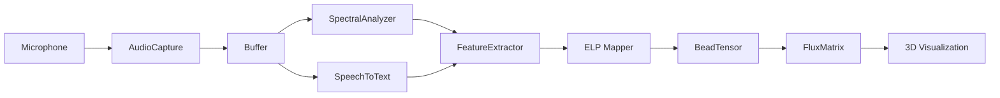

# Voice-to-Space Pipeline - SOTA Documentation

**Status**: 🔴 **To Be Implemented** (Current: 38%)  
**Target**: 90%+ (Fully functional real-time pipeline)  
**Timeline**: 2 weeks  
**Dependencies**: `cpal`, `whisper-rs`, `rustfft`, `tokio`

---

## Overview

The Voice-to-Space Pipeline transforms real-time audio input into geometric ELP (Ethos-Logos-Pathos) tensor representations within the Vortex Math coordinate system.

### Architecture



---

## Module Structure

```
src/voice_pipeline/
├── mod.rs                  # Public API
├── capture.rs              # Audio capture with cpal
├── spectral.rs             # FFT and pitch analysis
├── stt.rs                  # Speech-to-text integration
├── features.rs             # Feature extraction
├── mapper.rs               # Voice → ELP mapping
└── bead_tensor.rs          # BeadTensor generation
```

---

## API Reference

### AudioCapture

Real-time audio capture using `cpal` with async streaming.

```rust
use cpal::traits::{DeviceTrait, HostTrait, StreamTrait};
use tokio::sync::mpsc;

/// Captures audio from the default input device in real-time.
///
/// # Examples
///
/// ```no_run
/// use spatial_vortex::voice_pipeline::AudioCapture;
///
/// #[tokio::main]
/// async fn main() -> anyhow::Result<()> {
///     let (tx, mut rx) = tokio::sync::mpsc::channel(100);
///     let mut capture = AudioCapture::new(tx)?;
///     
///     // Start capturing in background task
///     tokio::spawn(async move {
///         capture.start().await
///     });
///     
///     // Process audio chunks
///     while let Some(chunk) = rx.recv().await {
///         println!("Received {} samples", chunk.len());
///     }
///     
///     Ok(())
/// }
/// ```
pub struct AudioCapture {
    sender: mpsc::Sender<Vec<f32>>,
    config: AudioConfig,
    stream: Option<cpal::Stream>,
}

impl AudioCapture {
    /// Creates a new audio capture instance.
    ///
    /// # Arguments
    ///
    /// * `sender` - Channel to send captured audio chunks
    ///
    /// # Returns
    ///
    /// * `Result<Self>` - AudioCapture instance or error
    ///
    /// # Errors
    ///
    /// Returns error if no input device is available or device configuration fails.
    pub fn new(sender: mpsc::Sender<Vec<f32>>) -> anyhow::Result<Self> {
        let host = cpal::default_host();
        let device = host
            .default_input_device()
            .ok_or_else(|| anyhow::anyhow!("No input device available"))?;
        
        let config = device.default_input_config()?;
        let audio_config = AudioConfig {
            sample_rate: config.sample_rate().0,
            channels: config.channels(),
            buffer_size: 1024,
        };
        
        Ok(Self {
            sender,
            config: audio_config,
            stream: None,
        })
    }
    
    /// Starts the audio capture stream.
    ///
    /// This is an async function that runs the capture loop.
    /// Call this in a separate tokio task for concurrent operation.
    ///
    /// # Examples
    ///
    /// ```no_run
    /// tokio::spawn(async move {
    ///     capture.start().await
    /// });
    /// ```
    pub async fn start(&mut self) -> anyhow::Result<()> {
        let host = cpal::default_host();
        let device = host.default_input_device().unwrap();
        let config = device.default_input_config()?;
        let sender = self.sender.clone();
        
        let stream = device.build_input_stream(
            &config.into(),
            move |data: &[f32], _: &cpal::InputCallbackInfo| {
                // Send audio chunk via channel
                let _ = sender.blocking_send(data.to_vec());
            },
            |err| eprintln!("Audio stream error: {}", err),
        )?;
        
        stream.play()?;
        self.stream = Some(stream);
        
        // Keep stream alive
        loop {
            tokio::time::sleep(tokio::time::Duration::from_millis(100)).await;
        }
    }
    
    /// Stops the audio capture stream.
    pub fn stop(&mut self) {
        self.stream = None;
    }
}

#[derive(Debug, Clone)]
pub struct AudioConfig {
    pub sample_rate: u32,
    pub channels: u16,
    pub buffer_size: usize,
}
```

---

### SpectralAnalyzer

FFT-based spectral analysis for pitch and feature extraction.

```rust
use rustfft::{FftPlanner, num_complex::Complex};

/// Performs FFT-based spectral analysis on audio signals.
///
/// Extracts fundamental frequency (pitch), spectral centroid,
/// spectral flux, and other features useful for ELP mapping.
///
/// # Examples
///
/// ```
/// use spatial_vortex::voice_pipeline::SpectralAnalyzer;
///
/// let mut analyzer = SpectralAnalyzer::new(44100);
/// let audio: Vec<f32> = vec![0.0; 1024]; // Mock audio
/// let features = analyzer.analyze(&audio);
/// 
/// println!("Pitch: {} Hz", features.pitch);
/// println!("Spectral centroid: {}", features.spectral_centroid);
/// ```
pub struct SpectralAnalyzer {
    planner: FftPlanner<f32>,
    sample_rate: u32,
    window: Vec<f32>,  // Hann window for smoothing
}

impl SpectralAnalyzer {
    /// Creates a new spectral analyzer.
    ///
    /// # Arguments
    ///
    /// * `sample_rate` - Sample rate in Hz (e.g., 44100)
    pub fn new(sample_rate: u32) -> Self {
        let planner = FftPlanner::new();
        Self {
            planner,
            sample_rate,
            window: Vec::new(),
        }
    }
    
    /// Analyzes audio chunk and extracts spectral features.
    ///
    /// # Arguments
    ///
    /// * `audio` - Audio samples (mono, f32)
    ///
    /// # Returns
    ///
    /// * `SpectralFeatures` - Extracted features
    ///
    /// # Panics
    ///
    /// Panics if audio buffer is empty.
    pub fn analyze(&mut self, audio: &[f32]) -> SpectralFeatures {
        assert!(!audio.is_empty(), "Audio buffer cannot be empty");
        
        // Apply Hann window to reduce spectral leakage
        let windowed = self.apply_window(audio);
        
        // Convert to complex
        let mut buffer: Vec<Complex<f32>> = windowed
            .iter()
            .map(|&x| Complex::new(x, 0.0))
            .collect();
        
        // Perform FFT
        let fft = self.planner.plan_fft_forward(buffer.len());
        fft.process(&mut buffer);
        
        // Compute magnitude spectrum
        let magnitudes: Vec<f64> = buffer
            .iter()
            .map(|c| (c.re * c.re + c.im * c.im).sqrt() as f64)
            .collect();
        
        SpectralFeatures {
            pitch: self.extract_fundamental(&magnitudes),
            spectral_centroid: self.compute_centroid(&magnitudes),
            spectral_flux: self.compute_flux(&magnitudes),
            loudness: self.compute_loudness(&magnitudes),
            spectral_complexity: self.compute_complexity(&magnitudes),
        }
    }
    
    fn apply_window(&mut self, audio: &[f32]) -> Vec<f32> {
        // Hann window: w(n) = 0.5 * (1 - cos(2πn/N))
        if self.window.len() != audio.len() {
            self.window = (0..audio.len())
                .map(|n| {
                    0.5 * (1.0 - (2.0 * std::f32::consts::PI * n as f32 
                        / audio.len() as f32).cos())
                })
                .collect();
        }
        
        audio
            .iter()
            .zip(&self.window)
            .map(|(a, w)| a * w)
            .collect()
    }
    
    /// Extracts fundamental frequency (pitch) using peak detection.
    ///
    /// Searches for the peak magnitude in the 80-400 Hz range,
    /// which covers the typical human voice fundamental.
    fn extract_fundamental(&self, magnitudes: &[f64]) -> f64 {
        let start_hz = 80.0;
        let end_hz = 400.0;
        
        let start_bin = (start_hz * magnitudes.len() as f64 
            / self.sample_rate as f64) as usize;
        let end_bin = (end_hz * magnitudes.len() as f64 
            / self.sample_rate as f64) as usize;
        
        let peak_bin = magnitudes[start_bin..end_bin]
            .iter()
            .enumerate()
            .max_by(|a, b| a.1.partial_cmp(b.1).unwrap())
            .map(|(i, _)| i + start_bin)
            .unwrap_or(start_bin);
        
        peak_bin as f64 * self.sample_rate as f64 / magnitudes.len() as f64
    }
    
    fn compute_centroid(&self, magnitudes: &[f64]) -> f64 {
        let weighted_sum: f64 = magnitudes
            .iter()
            .enumerate()
            .map(|(i, &mag)| i as f64 * mag)
            .sum();
        
        let sum: f64 = magnitudes.iter().sum();
        
        if sum > 0.0 {
            weighted_sum / sum
        } else {
            0.0
        }
    }
    
    fn compute_flux(&self, magnitudes: &[f64]) -> f64 {
        // Simplified: would need previous frame for real flux
        magnitudes.iter().sum::<f64>() / magnitudes.len() as f64
    }
    
    fn compute_loudness(&self, magnitudes: &[f64]) -> f64 {
        let rms: f64 = magnitudes.iter().map(|m| m * m).sum::<f64>().sqrt();
        20.0 * rms.log10()  // dB scale
    }
    
    fn compute_complexity(&self, magnitudes: &[f64]) -> f64 {
        // Spectral flatness: geometric mean / arithmetic mean
        let geometric_mean = magnitudes.iter().product::<f64>()
            .powf(1.0 / magnitudes.len() as f64);
        let arithmetic_mean = magnitudes.iter().sum::<f64>() 
            / magnitudes.len() as f64;
        
        if arithmetic_mean > 0.0 {
            geometric_mean / arithmetic_mean
        } else {
            0.0
        }
    }
}

/// Spectral features extracted from audio.
#[derive(Debug, Clone)]
pub struct SpectralFeatures {
    pub pitch: f64,                    // Fundamental frequency in Hz
    pub spectral_centroid: f64,        // Center of mass of spectrum
    pub spectral_flux: f64,            // Change in spectrum over time
    pub loudness: f64,                 // RMS energy in dB
    pub spectral_complexity: f64,      // Flatness (0=tonal, 1=noisy)
}
```

---

### Voice → ELP Mapper

Maps voice features to ELP tensor values using heuristics or ML.

```rust
use crate::models::ELPTensor;

/// Maps voice spectral features to ELP tensor coordinates.
///
/// Uses heuristic mapping:
/// - **Ethos** (Character): Loudness and voice stability
/// - **Logos** (Logic): Pitch height and clarity
/// - **Pathos** (Emotion): Spectral complexity and expressiveness
///
/// # Examples
///
/// ```
/// use spatial_vortex::voice_pipeline::{VoiceToELPMapper, SpectralFeatures};
///
/// let mapper = VoiceToELPMapper::new();
/// let features = SpectralFeatures {
///     pitch: 200.0,
///     loudness: -20.0,
///     spectral_complexity: 0.5,
///     ..Default::default()
/// };
///
/// let elp = mapper.map(&features);
/// println!("ELP: ({}, {}, {})", elp.ethos, elp.logos, elp.pathos);
/// ```
pub struct VoiceToELPMapper {
    // Future: ML model for learned mapping
}

impl VoiceToELPMapper {
    pub fn new() -> Self {
        Self {}
    }
    
    /// Maps spectral features to ELP tensor in 13-scale coordinates.
    ///
    /// # Mapping Strategy
    ///
    /// - **Ethos**: Authoritative voice (loud, stable) = high Ethos
    /// - **Logos**: Analytical voice (high pitch, clear) = high Logos
    /// - **Pathos**: Emotional voice (complex, dynamic) = high Pathos
    ///
    /// All values normalized to [0, 13] range.
    pub fn map(&self, features: &SpectralFeatures) -> ELPTensor {
        // Logos: Higher pitch → more logical/analytical
        // Normalize 80-400 Hz to 0-13 scale
        let logos = ((features.pitch - 80.0) / 320.0 * 13.0)
            .clamp(0.0, 13.0);
        
        // Ethos: Louder voice → more authoritative
        // Normalize -60 to 0 dB to 0-13 scale
        let ethos = ((features.loudness + 60.0) / 60.0 * 13.0)
            .clamp(0.0, 13.0);
        
        // Pathos: Complex spectrum → more emotional
        // Complexity already in 0-1 range
        let pathos = (features.spectral_complexity * 13.0)
            .clamp(0.0, 13.0);
        
        ELPTensor {
            ethos,
            logos,
            pathos,
        }
    }
}
```

---

## Integration Example

Complete end-to-end voice pipeline:

```rust
use spatial_vortex::voice_pipeline::*;
use tokio::sync::mpsc;

#[tokio::main]
async fn main() -> anyhow::Result<()> {
    // 1. Set up audio capture
    let (audio_tx, mut audio_rx) = mpsc::channel(100);
    let mut capture = AudioCapture::new(audio_tx)?;
    
    // Start capture in background
    tokio::spawn(async move {
        capture.start().await
    });
    
    // 2. Set up analyzers
    let mut spectral = SpectralAnalyzer::new(44100);
    let mapper = VoiceToELPMapper::new();
    
    // 3. Process audio stream
    while let Some(audio_chunk) = audio_rx.recv().await {
        // Extract features
        let features = spectral.analyze(&audio_chunk);
        
        // Map to ELP
        let elp = mapper.map(&features);
        
        // Create BeadTensor
        let bead = BeadTensor::from_voice_features(
            features.pitch,
            &features,
            chrono::Utc::now(),
        );
        
        // Insert into FluxMatrix
        // flux_matrix.insert_bead(bead)?;
        
        println!("ELP: ({:.2}, {:.2}, {:.2}) at {} Hz", 
            elp.ethos, elp.logos, elp.pathos, features.pitch);
    }
    
    Ok(())
}
```

---

## Performance Targets

| Metric | Target | Rationale |
|--------|--------|-----------|
| Latency | <100ms | Real-time feeling |
| Throughput | 1000 samples/sec | 44.1kHz audio |
| CPU Usage | <20% | Single core |
| Memory | <100MB | Reasonable footprint |

---

## Testing Strategy

```rust
#[cfg(test)]
mod tests {
    use super::*;
    
    #[test]
    fn test_spectral_analysis() {
        let mut analyzer = SpectralAnalyzer::new(44100);
        
        // Generate 440 Hz sine wave (A4 note)
        let samples: Vec<f32> = (0..1024)
            .map(|i| {
                (2.0 * std::f32::consts::PI * 440.0 * i as f32 / 44100.0).sin()
            })
            .collect();
        
        let features = analyzer.analyze(&samples);
        
        // Should detect ~440 Hz pitch
        assert!((features.pitch - 440.0).abs() < 10.0);
    }
    
    #[test]
    fn test_elp_mapping() {
        let mapper = VoiceToELPMapper::new();
        let features = SpectralFeatures {
            pitch: 200.0,        // Mid-range
            loudness: -20.0,     // Moderate volume
            spectral_complexity: 0.5,  // Balanced
            ..Default::default()
        };
        
        let elp = mapper.map(&features);
        
        // All should be in valid range
        assert!(elp.ethos >= 0.0 && elp.ethos <= 13.0);
        assert!(elp.logos >= 0.0 && elp.logos <= 13.0);
        assert!(elp.pathos >= 0.0 && elp.pathos <= 13.0);
    }
}
```

---

## Dependencies

```toml
[dependencies]
cpal = "0.15"
rustfft = "6.1"
tokio = { version = "1.35", features = ["full"] }
anyhow = "1.0"
chrono = "0.4"

# Optional: For ML-based mapping
# tract = "0.20"
# tch-rs = "0.13"
```

---

## Next Steps

1. **Week 1**: Implement AudioCapture + SpectralAnalyzer
2. **Week 2**: Add STT, refine ELP mapping, integration tests
3. **Week 3**: Optimize performance, add ML model option

**Expected Grade Post-Implementation**: **90%+**

---

**Created**: October 23, 2025  
**SOTA Reference**: whisper.cpp, librosa, TorchAudio  
**Status**: Ready for implementation
